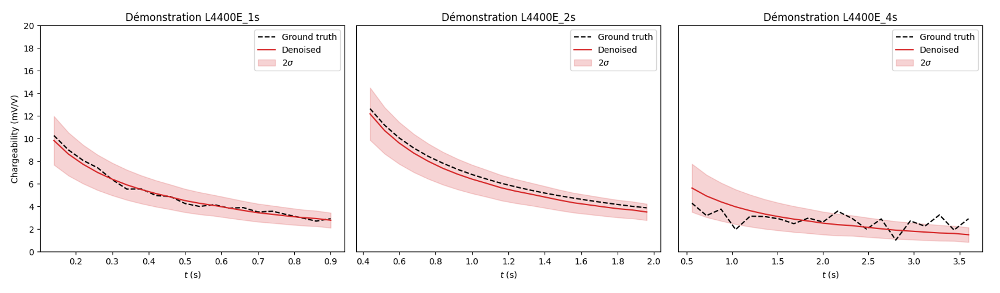
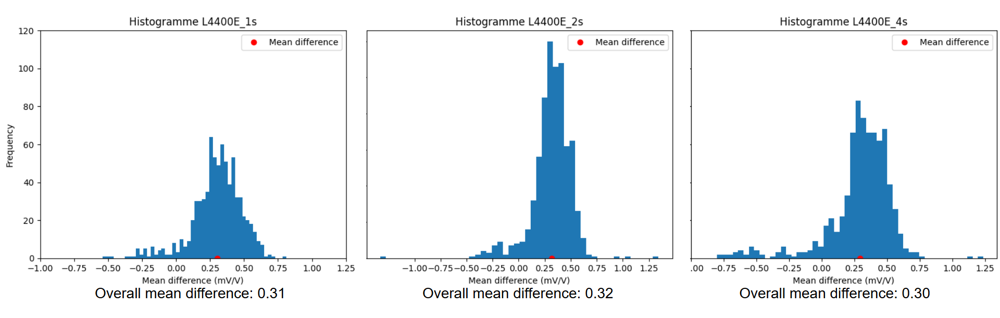

# Projet VAE été 2025: Comparaison de l'efficacité de l'algorithme IP-VAE sur des essais de 1s, 2s et 4s
### par Isabelle Poliquin et Charles L. Bérubé

## But

Évaluer l'efficacité de l'agorithme [IP-VAE développé par Pierre en 2021](https://github.com/clberube/ip-vae) pour des essais de 1 second sur des essais de 2 secondes et 4 secondes. 

## Méthodologie

Ce projet est basé sur le même algorithme mentionné précédemment. Les modifications apportées au code avaient pour but de rendre l'algorithme compatible avec les essais de 2 secondes et 4 secondes. Trois fichiers contenant des essais de 1 secondes, 2 secondes et 4 secondes effectués au même endroit pour faire la comparaison. Tous les graphiques illustrés sont basé sur les calculs suivants: 

$$ écart (mV/V) = {D - B} $$

$$ écart (mV/V) = {(D - B)*100 \over D}$$

où: 
- D: Données débruitées
- B: Données brutes

## Résultats
** Note: Les trois premiers graphiques ont été effectué sur trois essais spécifiques (différents). Les autres graphiques s'appliquent aux fichiers en entier. **

### Algorithme brute

  

Tel qu'il est possible de voir dans les graphiques, le résultat de l'algorithme est près des courbes brûtes. La courbe brûte est incluse dans l'écart type du résultat de l'algorithme dans les trois cas. La courbe débruitée est toutefois légèrement inférieure à la courbe brûte, et ce dans les trois cas. 

### Distribution des écarts

  

Les trois histogrammes illustrent une distribution des écarts similaires dans les trois cas. La majorité des écart sont négatifs, c'est-à-dire que dans la pluspart des cas la courbe brûte est supérieure à la courbe débruitée. Également, la moyenne des écarts est très similaire dans les trois cas, variant entre 0,30 mV/V et 0,32 mV/V. La distribution des écarts est la plus restrainte dans le cas des essais de 2 secondes et l'inverse pour les essais de 4 secondes. 

### Biais selon le fenêtre

  

Les trois graphiques montrent que le biais diminue en valeur au fur et à mesure que le temps s'écoule. Ceci est logique puisque les estimations effectuées par l'algorithme au début de l'essai ont moins de valeurs précédentes pour faire les calculs comparés aux estimations à la fin de l'essai. De plus, les données "abérantes" semblent aussi être à la même position dans les trois cas (ex: au 10e point). Toutefois, les trois courbes ont la même forme. 

### Biais selon le courant injecté

  

Il est important de noter que le courant injecté pour les essais de 1 secondes et 2 secondes a une valeur maximale de 4A tandis que ceux de 4 secondes ont un maximum de 7A. La valeur moyenne du biais dans les trois cas commence à environ 0,25 mV/V et augmente de façon relativement constante pour terminer à une valeur d'environ 0,50 mV/V. 

### Biais selon Vp

  

Les valeurs abérantes sont concentrées aux extrêmes des essais, c'est-à-dire au début et à la fin des essais. La valeur moyenne du biais est d'environ 0,5 V pour les valeurs de Vp minimum et diminue légèrement avec l'augmentation de Vp. Cette tendance est similaire dans les trois cas. Les valeurs de biais abérantes sont principalement associées aux valeurs de Vp extrêmes. 

## Conclusion 

- Les résultats de l’algorithme de débruitage sur les essais de 1s, 2s et 4s sont très similaires 
- Le biais dans les trois cas reste dans le même intervalle
  - Exceptions: données extrêmes
- La forme est relativement constante peu importe l’amplitude
- Au niveau de la performance de l'algorithme, aucun réentraînement de l’algorithme est nécessaire
  - L’algorithme n’est pas affecté par la différence entre les courbes brutes 
  - Un réentraînement est nécessaire uniquement pour la rigueur scientifique 
